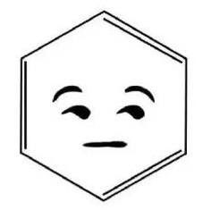
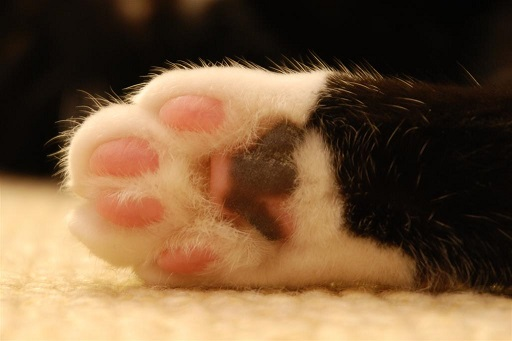
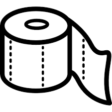
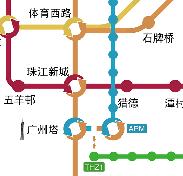
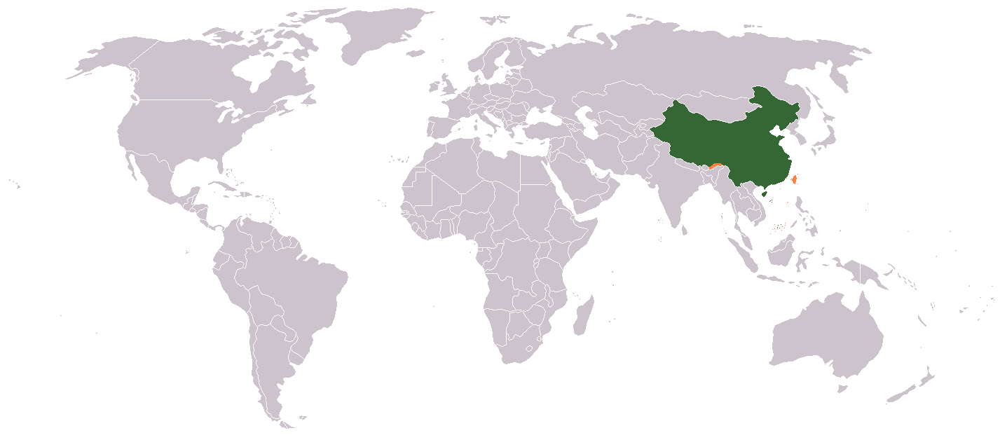
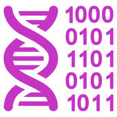
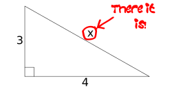
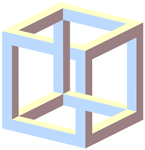
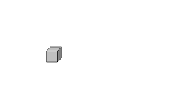



    

        <table style="background: #ffffff; width: 236px; height: 45px;">
            <tbody>
                <tr>
                    <td class="icon" style="background: #ffffff; font-size: 11pt; color: #000000; width: 45px; height: 45px;">
                        
                    </td>
                    <td class="disc" style="background: #ffffff; font-size: 9pt; color: #000000; height: 45px;">
                        这是默认样式
                    </td>
                </tr>
            </tbody>
        </table>
    

    

        <table style="background: #000000; width: 236px; height: 45px;">
            <tbody>
                <tr>
                    <td class="icon" style="background: #ffffff; font-size: 11pt; color: #000000; width: 45px; height: 45px;">
                        Zzz…
                    </td>
                    <td class="disc" style="background: #000000; font-size: 9pt; color: #ffffff; height: 45px;">该用户太懒了, 还没开始好好编辑用户页面. </td>
                </tr>
            </tbody>
        </table>
    

    

        <table style="background: #ffe496; width: 236px; height: 45px;">
            <tbody>
                <tr>
                    <td class="icon" style="background: #ffb466; font-size: 11pt; color: #000000; width: 45px; height: 45px;">
                        
                    </td>
                    <td class="disc" style="background: #ffe496; font-size: 10pt; color: #000000; height: 45px;">
                        这个创意来自
                        <b>
                            <a href="https://zh.wikipedia.org/wiki/Wikipedia:%E7%94%A8%E6%88%B6%E6%A1%86" target="_blank" title="Wikipedia:用户框">维基用户框</a>
                        </b>.
                    </td>
                </tr>
            </tbody>
        </table>
    

    

        <table style="background: #bfeabf; width: 236px; height: 45px;">
            <tbody>
                <tr>
                    <td class="icon" style="background: #05cc88; font-size: 14pt; color: #000000; width: 45px; height: 45px;">
                        
                    </td>
                    <td class="disc" style="background: #bfeabf; font-size: 9pt; color: #000000; height: 45px;">以下所有的该用户都是指
                        <b>本宝宝</b>. </td>
                </tr>
            </tbody>
        </table>
    

    

        <table style="background: #4080f0; width: 236px; height: 45px;">
            <tbody>
                <tr>
                    <td class="icon" style="background: #f08040; font-size: 14pt; color: #000000; width: 45px; height: 45px;">
                        Orz
                    </td>
                    <td class="disc" style="background: #4080f0; font-size: 9pt; color: #000000; height: 45px;">
                        这个用户是个
                        <a href="https://zh.wikipedia.org/wiki/%E5%A5%BD%E4%BA%BA%E6%96%87%E5%8C%96" target="_blank"
                            title="好人文化">
                            好人
                        </a>. =￣ω￣=
                    </td>
                </tr>
            </tbody>
        </table>
    

    

        <table style="background: #c0c0c0; width: 236px; height: 45px;">
            <tbody>
                <tr>
                    <td class="icon" style="background: #c0c0c0; font-size: 11pt; color: #000000; width: 67px; height: 45px;">
                        
                    </td>
                    <td class="disc" style="background: #c0c0c0; font-size: 9pt; color: #000000; height: 45px;">这个用户喜欢
                        <b>
                            <a href="https://zh.wikipedia.org/wiki/%E8%B2%93" target="_blank" title="猫">猫</a>
                        </b>. (ฅ&gt;ω&lt;*ฅ)</td>
                </tr>
            </tbody>
        </table>
    

    

        <table style="background: #eeffff; width: 236px; height: 45px;">
            <tbody>
                <tr>
                    <td class="icon" style="background: #88ffff; font-size: 11pt; color: #000000; width: 45px; height: 45px;">
                        高中
                    </td>
                    <td class="disc" style="background: #eeffff; font-size: 10pt; color: #000000; height: 45px;">这个用户已经
                        <a href="https://zh.wikipedia.org/wiki/Category:%E9%AB%98%E4%B8%AD%E7%95%A2%E6%A5%AD%E7%B6%AD%E5%9F%BA%E4%BA%BA"
                            target="_blank" title="Category:高中毕业维基人">高中毕业</a>. </td>
                </tr>
            </tbody>
        </table>
    

    

        <table style="background: #f5f5dc; width: 236px; height: 45px;">
            <tbody>
                <tr>
                    <td class="icon" style="background: #1e90ff; font-size: 11pt; color: #000000; width: 45px; height: 45px;">
                        
                    </td>
                    <td class="disc" style="background: #f5f5dc; font-size: 9pt; color: #000000; height: 45px;">这个用户有
                        <b>
                            <a href="https://zh.wikipedia.org/wiki/%E8%BF%91%E8%A6%96" target="_blank" title="近视">近视</a>
                        </b>. 20米外六亲不认
                         50米外雌雄不辨100米外人畜不分. </td>
                </tr>
            </tbody>
        </table>
    

    

        <table style="background: #ffffff; width: 236px; height: 45px;">
            <tbody>
                <tr>
                    <td class="icon" style="background: #cc0000; font-size: 20pt; color: #ffffff; width: 45px; height: 45px;">
                        ?
                    </td>
                    <td class="disc" style="background: #ffffff; font-size: 9pt; color: #000000; height: 45px;">这位用户不愿透露自己的
                        <a href="https://zh.wikipedia.org/wiki/%E8%A1%80%E5%9E%8B" target="_blank" title="血型">血型</a>. </td>
                </tr>
            </tbody>
        </table>
    

    

        <table style="background: #73dc69; width: 234px; height: 43px;">
            <tbody>
                <tr>
                    <td class="icon" style="background: #006400; font-size: 15pt; color: #228b22; width: 45px; height: 43px;">
                        囧
                    </td>
                    <td class="disc" style="background: #73dc69; font-size: 10pt; color: #000000; height: 43px;">这个用户目前还没有被
                        <a href="https://zh.wikipedia.org/wiki/%E5%83%B1%E5%82%AD" target="_blank" title="雇佣">雇佣</a></td>
                    <td class="iconr" style="background: #006400; font-size: 15pt; color: #228b22; width: 45px; height: 43px;">
                        冏
                    </td>
                </tr>
            </tbody>
        </table>
    

    

        <table style="background: #87ceeb; width: 236px; height: 45px;">
            <tbody>
                <tr>
                    <td class="icon" style="background: #000000; font-size: 20pt; color: #ffffff; width: 45px; height: 45px;">
                        18
                    </td>
                    <td class="disc" style="background: #87ceeb; font-size: 10pt; color: #000000; height: 45px;">这个用户今年18碎, 明年18碎, 永远都是18碎. </td>
                </tr>
            </tbody>
        </table>
    

    

        <table style="background: #99ccff; width: 236px; height: 45px;">
            <tbody>
                <tr>
                    <td class="icon" style="background: #ffffff; font-size: 11pt; color: #000000; width: 45px; height: 45px;">
                        
                    </td>
                    <td class="disc" style="background: #ffffff; font-size: 10pt; color: #000000; height: 45px;">这个用户来到这个世界上
                         已有
                        0天了. </td>
                </tr>
            </tbody>
        </table>
    

    

        <table style="background: #888888; width: 236px; height: 45px;">
            <tbody>
                <tr>
                    <td class="icon" style="background: #ffffff; font-size: 14pt; color: #000000; width: 45px; height: 45px;">
                        格言
                    </td>
                    <td class="disc" style="background: #888888; font-size: 9pt; color: #000000; height: 45px;">“
                        <b>做人不卖萌跟咸鱼有什么区别</b>“
                         是这个用户的座右铭. </td>
                </tr>
            </tbody>
        </table>
    

    

        <table style="background: #aaeaff; width: 236px; height: 45px;">
            <tbody>
                <tr>
                    <td class="icon" style="background: #ffffff; font-size: 11pt; color: #000000; width: 45px; height: 45px;">
                        
                    </td>
                    <td class="disc" style="background: #aaeaff; font-size: 11pt; color: #000000; height: 45px;">该用户是
                        <b>
                            <a href="https://zh.wikipedia.org/wiki/%E5%AE%85%E7%94%B7" target="_blank" title="宅男">宅男</a>
                        </b>. </td>
                    <td class="iconr" style="background: #ffffff; font-size: 11pt; color: #000000; width: 45px; height: 45px;">
                        
                    </td>
                </tr>
            </tbody>
        </table>
    

    

        <table style="background: #ffffff; width: 236px; height: 45px;">
            <tbody>
                <tr>
                    <td class="icon" style="background: #ff0000; font-size: 12pt; color: #ffffff; width: 45px; height: 45px;">
                        洪荒
                         之力
                    </td>
                    <td class="disc" style="background: #eeeeee; font-size: 9pt; color: #222222; height: 45px;">
                        该用户经常控制不住体内的洪荒之力和焚寂煞气.
                    </td>
                    <td class="icon" style="background: #ff0000; font-size: 12pt; color: #ffffff; width: 45px; height: 45px;">
                        焚寂
                         煞气
                    </td>
                </tr>
            </tbody>
        </table>
    

    

        <table style="background: #784365; width: 236px; height: 45px;">
            <tbody>
                <tr>
                    <td class="icon" style="background: #cccccc; font-size: 11pt; color: #000000; width: 90px; height: 45px;">
                        逼
                         bigger
                         格
                    </td>
                    <td class="disc" style="background: #498575; font-size: 9pt; color: #000000; height: 45px;">
                        该用户认为逼格就是中英文混排时留空的那一格.
                    </td>
                </tr>
            </tbody>
        </table>
    

    

        <table style="background: #634654; width: 236px; height: 45px;">
            <tbody>
                <tr>
                    <td class="icon" style="background: #ffffff; font-size: 11pt; color: #000000; width: 76px; height: 45px;">
                        
                    </td>
                    <td class="disc" style="background: #634654; font-size: 9pt; color: #ffffff; height: 45px;">
                        该用户的杀软综合征很早就痊愈了. (ﾉ&gt;ω&lt;)ﾉ
                    </td>
                </tr>
            </tbody>
        </table>
    

    

        <table style="background: #ffffff; width: 236px; height: 45px;">
            <tbody>
                <tr>
                    <td class="icon" style="background: #ffffff; font-size: 11pt; color: #000000; width: 80px; height: 45px;">
                        
                    </td>
                    <td class="disc" style="background: #ffffff; font-size: 9pt; color: #000000; height: 45px;">
                        这位用户喜欢
                        <a href="https://zh.wikipedia.org/wiki/%E5%9C%B0%E9%93%81" target="_blank" title="地铁">
                            
                                <b>地铁</b>
                            
                        </a>.
                    </td>
                    <td class="iconr" style="background: #ffffff; font-size: 11pt; color: #000000; width: 45px; height: 45px;">
                        
                    </td>
                </tr>
            </tbody>
        </table>
    

    

        <table style="background: #003399; width: 236px; height: 45px;">
            <tbody>
                <tr>
                    <td class="icon" style="background: #000000; font-size: 11pt; color: #ffffff; width: 102px; height: 45px;">
                        
                    </td>
                    <td class="disc" style="background: #003399; font-size: 9pt; color: #ffffff; height: 45px;">
                        这个用户是
                             中国人. 
                    </td>
                    <td class="iconr" style="background: #000000; font-size: 12pt; color: #ffffff; width: 45px; height: 45px;">
                        中国
                    </td>
                </tr>
            </tbody>
        </table>
    

    

        <table style="background: #CCDDF3; width: 236px; height: 45px;">
            <tbody>
                <tr>
                    <td class="icon" style="background: #CCDDF3; font-size: 11pt; color: #0073c4; width: 45px; height: 45px;">
                        
                    </td>
                    <td class="disc" style="background: #ffffff; font-size: 9pt; color: #0073c4; height: 45px;">该用户使用
                        <a href="https://zh.wikipedia.org/wiki/Google_Chrome" target="_blank" title="Google Chrome">Google Chrome</a> 浏览网页. </td>
                </tr>
            </tbody>
        </table>
    

    

        <table style="background: #000000; width: 236px; height: 45px;">
            <tbody>
                <tr>
                    <td class="icon" style="background: #ffffff; font-size: 11pt; color: #ffffff; width: 45px; height: 45px;">
                        
                    </td>
                    <td class="disc" style="background: #000000; font-size: 9pt; color: #ffffff; height: 45px;">该用户盗取邻居的
                        <a href="https://zh.wikipedia.org/wiki/WiFi" target="_blank" title="WiFi">
                            <b>
                                WiFi
                            </b>
                        </a>. </td>
                </tr>
            </tbody>
        </table>
    

    

        <table style="background: #00ffff; width: 236px; height: 45px;">
            <tbody>
                <tr>
                    <td class="icon" style="background: #ffff00; font-size: 10pt; color: #000000; width: 45px; height: 45px;">
                        
                    </td>
                    <td class="disc" style="background: #00ffff; font-size: 9pt; color: #000000; height: 45px;">这个用户使用
                        <b>
                            <a href="https://zh.wikipedia.org/wiki/%E7%94%B5%E5%AD%90%E9%82%AE%E4%BB%B6" target="_blank" title="电子邮件">电子邮件</a>
                        </b>
                         用户名
                        <a href="mailto:1491180173@qq.com" class="" target="_blank" title="Email">1491180173@qq.com</a>
                    </td>
                </tr>
            </tbody>
        </table>
    

    

        <table style="background: #FF9900; width: 236px; height: 45px;">
            <tbody>
                <tr>
                    <td class="icon" style="background: #0099ff; font-size: 16pt; color: #ffffff; width: 45px; height: 45px;">
                        
                    </td>
                    <td class="disc" style="background: #FF9900; font-size: 9pt; color: #000000; height: 45px;">这个用户使用
                        <b>
                            <a href="https://zh.wikipedia.org/wiki/%E8%85%BE%E8%AE%AFQQ" target="_blank" title="腾讯QQ">腾讯QQ</a>
                        </b>,
                         账号是
                        
                            <b>
                                <a rel="nofollow" href="http://wpa.qq.com/msgrd?v=3&amp;uin=1491180173&amp;Site=qq&amp;menu=yes"
                                    target="_blank">
                                    1491180173
                                </a>
                            </b>. 
                    </td>
                </tr>
            </tbody>
        </table>
    

    

        <table style="background: #c8e0a7; width: 236px; height: 45px;">
            <tbody>
                <tr>
                    <td class="icon" style="background: #005039; font-size: 12pt; color: #000000; width: 72px; height: 45px;">
                        We
                        Chat
                    </td>
                    <td class="disc" style="background: #c8e0a7; font-size: 9pt; color: #437309; height: 45px;">这个用户使用
                        <a href="https://zh.wikipedia.org/wiki/%E5%BE%AE%E4%BF%A1" target="_blank" title="微信">微信</a>
                          账号是: 1491180173</td>
                </tr>
            </tbody>
        </table>
    

    

        <table style="background: #C0C0C0; width: 236px; height: 45px;">
            <tbody>
                <tr>
                    <td class="icon" style="background: #BFCDD5; font-size: 11pt; color: #000000; width: 45px; height: 45px;">
                        
                    </td>
                    <td class="disc" style="background: #ffffff; font-size: 9pt; color: #000000; height: 45px;">这个用户有自己的
                        <b>
                            <a href="https://zh.wikipedia.org/wiki/Category:Blog_%E4%BD%BF%E7%94%A8%E8%80%85" target="_blank"
                                title="Blog">Blog</a>
                        </b>
                         链接:
                        <a rel="nofollow" href="https://jarven.top" target="_blank">个人的自留地</a>
                    </td>
                </tr>
            </tbody>
        </table>
    

    

        <table style="background: #ffffff; width: 236px; height: 45px;">
            <tbody>
                <tr>
                    <td class="icon" style="background: #ffffff; font-size: 11pt; color: #000000; width: 45px; height: 45px;">
                        
                    </td>
                    <td class="disc" style="background: #ffffff; font-size: 10pt; color: #000000; height: 45px;">该用户使用
                        <a href="https://zh.wikipedia.org/wiki/Google" target="_blank" title="Google">
                            G
                            o
                            o
                            g
                            l
                            e
                        </a> 搜索网络. </td>
                </tr>
            </tbody>
        </table>
    

    

        <table style="background: #000000; width: 236px; height: 45px;">
            <tbody>
                <tr>
                    <td class="icon" style="background: #BFCDD5; font-size: 11pt; color: #000000; width: 45px; height: 45px;">
                        
                    </td>
                    <td class="disc" style="background: #000000; font-size: 9pt; color: #ffffff; height: 45px;">
                        1&nbsp;&nbsp;&lt;
                        该用户
                        使
                        =
                        "用"&gt;
                        <b>
                            <a href="https://zh.wikipedia.org/wiki/Visual_Studio_Code" target="_blank" title="Visual_Studio_Code">
                                VS
                            </a>
                        </b>
                         
                        2&nbsp;&nbsp;
                        <b>
                            <a href="https://zh.wikipedia.org/wiki/Visual_Studio_Code" target="_blank" title="Visual_Studio_Code">
                                Code
                            </a>
                        </b>&lt;/
                        编辑文本文件&gt;
                    </td>
                </tr>
            </tbody>
        </table>
    

    

        <table style="background: #0e0e17; width: 236px; height: 45px;">
            <tbody>
                <tr>
                    <td class="icon" style="background: #2d2688; font-size: 11pt; color: #000000; width: 45px; height: 45px;">
                        
                    </td>
                    <td class="disc" style="background: #000000; font-size: 9pt; color: #ffffff; height: 45px;">该用户使用
                        <a href="https://zh.wikipedia.org/wiki/Adobe_Photoshop" target="_blank" title="Adobe Photoshop">
                            <b>
                                Photoshop
                            </b>
                        </a> 和
                        <a href="https://zh.wikipedia.org/wiki/Adobe_Illustrator" target="_blank" title="Adobe Illustrator">
                            <b>
                                Illustrator
                            </b>
                        </a> 处理图片. </td>
                    <td class="iconr" style="background: #2d2688; font-size: 11pt; color: #000000; width: 45px; height: 45px;">
                        
                    </td>
                </tr>
            </tbody>
        </table>
    

    

        <table style="background: #141817; width: 230px; height: 39px;">
            <tbody>
                <tr>
                    <td class="icon" style="background: #141817; font-size: 11pt; color: #ffffff; width: 45px; height: 39px;">
                        
                    </td>
                    <td class="disc" style="background: #141817; font-size: 9pt; color: #dddddd; height: 39px;">这位用户
                        <a href="https://zh.wikipedia.org/wiki/Windows_10#.E7.AE.80.E4.BD.93.E4.B8.AD.E6.96.87.E7.89.88.E4.B8.AD.E7.9A.84.E8.91.97.E5.90.8D.E7.AD.86.E8.AA.A4"
                            target="_blank" title="Windows 10">
                            
                                <b>坐和放宽</b>
                            
                        </a>. </td>
                </tr>
            </tbody>
        </table>
    

    

        <table style="background: #eb3c00; width: 234px; height: 43px;">
            <tbody>
                <tr>
                    <td class="icon" style="background: #ffffff; font-size: 11pt; color: #000000; width: 45px; height: 43px;">
                        
                    </td>
                    <td class="disc" style="background: #ffffff; font-size: 8pt; color: #000000; height: 43px;">该用户使用
                        <b>
                            <a href="https://zh.wikipedia.org/wiki/Microsoft_Office_2016" target="_blank" title="Microsoft Office 2016">Microsoft Office 2016</a>
                        </b> 编辑办公文档. </td>
                </tr>
            </tbody>
        </table>
    

    

        <table style="background: #E0E8FF; width: 236px; height: 45px;">
            <tbody>
                <tr>
                    <td class="icon" style="background: #99B3FF; font-size: 14pt; color: #000000; width: 45px; height: 45px;">
                        <a href="https://zh.wikipedia.org/wiki/PC" target="_blank" title="PC">PC</a>-3
                    </td>
                    <td class="disc" style="background: #ffffff; font-size: 8pt; color: #000000; height: 45px;">此用户熟练使用多个平台, 会自己组装台式机, 安装OS, 手动杀毒, 编写一般的程序. </td>
                </tr>
            </tbody>
        </table>
    

    

        <table style="background: #ffffff; width: 236px; height: 45px;">
            <tbody>
                <tr>
                    <td class="icon" style="background: #ffffff; font-size: 11pt; color: #000000; width: 90px; height: 45px;">
                        
                    </td>
                    <td class="disc" style="background: #ffffff; font-size: 9pt; color: #000000; height: 45px;">该用户认为
                        <a href="https://zh.wikipedia.org/wiki/PHP" target="_blank" title="PHP">拍黄片</a>是世界上最优秀的程序设计语言. </td>
                </tr>
            </tbody>
        </table>
    

    

        <table style="background: #ffffff; width: 236px; height: 45px;">
            <tbody>
                <tr>
                    <td class="icon" style="background: #ffffff; font-size: 11pt; color: #000000; width: 45px; height: 45px;">
                        
                    </td>
                    <td class="disc" style="background: #f16529; font-size: 9pt; color: #dddddd; height: 45px;">
                        该用户会一点简单的
                        <a href="https://zh.wikipedia.org/wiki/HTML" target="_blank" title="HTML">
                            How To Make Love
                        </a> 语言.
                    </td>
                </tr>
            </tbody>
        </table>
    

    

        <table style="background: #ffffff; width: 236px; height: 45px;">
            <tbody>
                <tr>
                    <td class="icon" style="background: #ffffff; font-size: 11pt; color: #000000; width: 45px; height: 45px;">
                        
                    </td>
                    <td class="disc" style="background: #ffffff; font-size: 9pt; color: #000000; height: 45px;">该用户不是
                        <a href="https://zh.wikipedia.org/wiki/%E7%BE%8E%E9%A3%9F%E5%AE%B6" target="_blank" title="美食家">饕餮客</a>, 请不要和他讨论美食. </td>
                </tr>
            </tbody>
        </table>
    

    

        <table style="background: #ffd700; width: 236px; height: 45px;">
            <tbody>
                <tr>
                    <td class="icon" style="background: #ffffff; font-size: 11pt; color: #000000; width: 45px; height: 45px;">
                        
                    </td>
                    <td class="disc" style="background: #ffffff; font-size: 10pt; color: #000000; height: 45px;">这个用户能在 200 秒内还原一个打乱的
                        <b>
                            <a href="https://zh.wikipedia.org/wiki/%E9%AD%94%E6%96%B9" target="_blank" title="魔方">三阶魔方</a>
                        </b>. </td>
                </tr>
            </tbody>
        </table>
    

    

        <table style="background: #ffffff; width: 234px; height: 43px;">
            <tbody>
                <tr>
                    <td class="icon" style="background: #ffffff; font-size: 16pt; color: #000000; width: 45px; height: 43px;">
                        盲
                    </td>
                    <td class="disc" style="background: #003399; font-size: 9pt; color: #ffffff; height: 43px;">这个用户在历史, 政治, 经济, 军事, 文化方面都是白痴. </td>
                </tr>
            </tbody>
        </table>
    

    

        <table style="background: #ffffff; width: 236px; height: 45px;">
            <tbody>
                <tr>
                    <td class="icon" style="background: #ffffff; font-size: 11pt; color: #000000; width: 74px; height: 45px;">
                        
                    </td>
                    <td class="disc" style="background: #ffffff; font-size: 9pt; color: #ff0000; height: 45px;">这个用户希望在其有生之年能目睹一次大规模撞击事件</td>
                </tr>
            </tbody>
        </table>
    

    

        <table style="background: #009F3C; width: 234px; height: 43px;">
            <tbody>
                <tr>
                    <td class="icon" style="background: #ffffff; font-size: 11pt; color: #000000; width: 79px; height: 43px;">
                        
                    </td>
                    <td class="disc" style="background: #ffffff; font-size: 10pt; color: #000000; height: 43px;">该用户认为
                        <a href="https://zh.wikipedia.org/wiki/%E8%BD%AC%E5%9F%BA%E5%9B%A0" target="_blank" title="转基因">转基因</a>是可行的. </td>
                </tr>
            </tbody>
        </table>
    

    

        <table style="background: #ffffff; width: 236px; height: 45px;">
            <tbody>
                <tr>
                    <td class="icon" style="background: #ffffff; font-size: 11pt; color: #000000; width: 45px; height: 45px;">
                        
                    </td>
                    <td class="disc" style="background: #ffffff; font-size: 9pt; color: #000000; height: 45px;">这个用户的诞生符合
                        <a href="https://zh.wikipedia.org/wiki/%E5%AD%9F%E5%BE%B7%E5%B0%94" target="_blank" title="孟德尔">孟德尔</a>的
                        <a href="https://zh.wikipedia.org/wiki/%E9%81%97%E4%BC%A0%E5%AE%9A%E5%BE%8B" target="_blank"
                            title="遗传定律">遗传定律</a>. </td>
                    <td class="icon" style="background: #ffffff; font-size: 11pt; color: #000000; width: 45px; height: 45px;">
                        
                    </td>
                </tr>
            </tbody>
        </table>
    

    

        <table style="background: #FFCC00; width: 236px; height: 45px;">
            <tbody>
                <tr>
                    <td class="icon" style="background: #ffffff; font-size: 11pt; color: #000000; width: 95px; height: 45px;">
                        
                    </td>
                    <td class="disc" style="background: #FFCC00; font-size: 9pt; color: #000000; height: 45px;">
                        该用户认为 e^(i*pi)+1=0
                         是最美的
                        <a href="https://zh.wikipedia.org/wiki/%E6%95%B0%E5%AD%A6" target="_blank" title="数学">数学</a>公式
                    </td>
                </tr>
            </tbody>
        </table>
    

    

        <table style="background: #D0F8FF; width: 236px; height: 45px;">
            <tbody>
                <tr>
                    <td class="icon" style="background: #77E0E8; font-size: 14pt; color: #000000; width: 100px; height: 45px;">
                        3.141592
                         65358…
                    </td>
                    <td class="disc" style="background: #ffffff; font-size: 9pt; color: #000000; height: 45px;">此用户能背诵
                        <a href="https://zh.wikipedia.org/wiki/%E5%9C%86%E5%91%A8%E7%8E%87" target="_blank" title="圆周率">圆周率</a>
                         小数点后
                        <b>7</b>位. </td>
                </tr>
            </tbody>
        </table>
    

    

        <table style="background: #ffdd77; width: 236px; height: 45px;">
            <tbody>
                <tr>
                    <td class="icon" style="background: #ffffff; font-size: 11pt; color: #000000; width: 61px; height: 45px;">
                        
                    </td>
                    <td class="disc" style="background: #ffffff; font-size: 9pt; color: #000000; height: 45px;">这个用户知道
                        <b>
                            <a href="https://zh.wikipedia.org/wiki/0.999%E2%80%A6" target="_blank" title="0.999…">0.999…就是1. </a>
                        </b>
                    </td>
                </tr>
            </tbody>
        </table>
    

    

        <table style="background: #C8B4B8; width: 234px; height: 43px;">
            <tbody>
                <tr>
                    <td class="disc" style="background: #C8B4B8; font-size: 9pt; color: #000000; height: 43px;">这个用户知道怎样找出
                        <a href="https://zh.wikipedia.org/wiki/%E6%9C%AA%E7%9F%A5%E6%95%B0" target="_blank" title="未知数">
                            
                                <i>
                                    <b>x</b>
                                </i>
                            
                        </a>
                    </td>
                    <td class="iconr" style="background: #ffffff; font-size: 11pt; color: #000000; width: 83px; height: 43px;">
                        
                    </td>
                </tr>
            </tbody>
        </table>
    

    

        <table style="background: #c0c0c0; width: 236px; height: 45px;">
            <tbody>
                <tr>
                    <td class="icon" style="background: #2f4f4f; font-size: 14pt; color: #000000; width: 45px; height: 45px;">
                        ζ(s)
                    </td>
                    <td class="disc" style="background: #ffffff; font-size: 10pt; color: #000000; height: 45px;">这个用户坚信
                        <a href="https://zh.wikipedia.org/wiki/%E6%B3%A2%E6%81%A9%E5%93%88%E5%BE%B7%C2%B7%E9%BB%8E%E6%9B%BC"
                            target="_blank" title="波恩哈德·黎曼">黎曼</a>是
                        <a href="https://zh.wikipedia.org/wiki/%E9%BB%8E%E6%9B%BC%E7%8C%9C%E6%83%B3" target="_blank"
                            title="黎曼猜想">对</a>的. </td>
                </tr>
            </tbody>
        </table>
    

    

        <table style="background: #4169E1; width: 236px; height: 45px;">
            <tbody>
                <tr>
                    <td class="icon" style="background: #ffffff; font-size: 12pt; color: #4169E1; width: 45px; height: 45px;">
                        <a href="https://zh.wikipedia.org/wiki/User:%E4%B9%8C%E6%8B%89%E8%B7%A8%E6%B0%AA" target="_blank" title="User:乌拉跨氪">乌拉
                             跨氪</a>
                    </td>
                    <td class="disc" style="background: #4169E1; font-size: 10pt; color: #dddddd; height: 45px;">我们
                        <a href="https://zh.wikipedia.org/wiki/Category:%E5%B4%87%E6%8B%9C%E4%B9%8C%E6%8B%89%E8%B7%A8%E6%B0%AA%E7%9A%84%E7%BB%B4%E5%9F%BA%E4%BA%BA"
                            target="_blank" title="Category:崇拜乌拉跨氪的维基人">
                            仍未知道
                        </a>那天所看见的
                        <a href="https://zh.wikipedia.org/wiki/Template:%E7%8C%AA%E7%AC%BC%E8%8D%89%E5%B1%9E" target="_blank"
                            title="Template:猪笼草属">
                            猪笼草
                        </a>的名字. </td>
                </tr>
            </tbody>
        </table>
    

    

        <table style="background: #cecece; width: 234px; height: 43px;">
            <tbody>
                <tr>
                    <td class="icon" style="background: #000000; font-size: 11pt; color: #ffff00; width: 45px; height: 43px;">
                        &gt;﹏&lt;
                    </td>
                    <td class="disc" style="background: #cecece; font-size: 9pt; color: #000000; height: 43px;">这名用户对中国大陆的
                        <a href="https://zh.wikipedia.org/wiki/%E9%BB%91%E5%BF%83%E5%95%86%E5%93%81" target="_blank"
                            title="黑心商品">黑心商品</a>和
                        <a href="https://zh.wikipedia.org/wiki/%E9%BB%91%E5%BF%83%E9%A3%9F%E5%93%81" target="_blank"
                            title="黑心食品">黑心食品</a>感到害怕. </td>
                </tr>
            </tbody>
        </table>
    

    

        <table style="background: #000000; width: 236px; height: 45px;">
            <tbody>
                <tr>
                    <td class="icon" style="background: #000000; font-size: 9pt; color: #ffffff; width: 45px; height: 45px;">
                        Death
                         Note
                    </td>
                    <td class="disc" style="background: #000000; font-size: 9pt; color: #ffffff; height: 45px;">这个用户想成为
                        <a href="https://zh.wikipedia.org/wiki/%E6%AD%BB%E4%BA%A1%E7%AC%94%E8%AE%B0" target="_blank" title="死亡笔记">
                            新世界的神
                        </a>. </td>
                </tr>
            </tbody>
        </table>
    

    

        <table style="background: #000000; width: 236px; height: 45px;">
            <tbody>
                <tr>
                    <td class="icon" style="background: #ffffff; font-size: 12pt; color: #000000; width: 45px; height: 45px;">
                        <del>
                            中文
                                 配音
                        </del>
                    </td>
                    <td class="disc" style="background: #000000; font-size: 10pt; color: #ffffff; height: 45px;">这个用户痛恨
                        <b>中文配音</b>. </td>
                </tr>
            </tbody>
        </table>
    

    

        <table style="background: #990000; width: 234px; height: 43px;">
            <tbody>
                <tr>
                    <td class="icon" style="background: #ffffff; font-size: 12pt; color: #000000; width: 45px; height: 43px;">
                        
                            <a href="https://zh.wikipedia.org/wiki/Category:FFF%E5%9B%A2%E7%BB%B4%E5%9F%BA%E7%99%BE%E7%A7%91%E5%88%86%E9%83%A8%E5%9B%A2%E5%91%98"
                                target="_blank" title="Category:FFF团维基百科分部团员">
                                FFF
                            </a>
                        
                    </td>
                    <td class="disc" style="background: #990000; font-size: 11pt; color: #ffffff; height: 43px;">&nbsp;
                        <b>烧死那对
                            <a href="https://zh.wikipedia.org/wiki/%E5%BC%82%E6%80%A7%E6%81%8B" target="_blank" title="异性恋">
                                异性恋
                            </a>！</b>
                        （误）
                    </td>
                </tr>
            </tbody>
        </table>
    

    

        <table style="background: #f6f6f6; width: 236px; height: 45px;">
            <tbody>
                <tr>
                    <td class="icon" style="background: #f6f6f6; font-size: 11pt; color: #000000; width: 45px; height: 45px;">
                        
                    </td>
                    <td class="disc" style="background: #f6f6f6; font-size: 10pt; color: #000000; height: 45px;">该用户喜欢看
                        <b>
                            <a href="https://zh.wikipedia.org/wiki/%E7%A7%91%E5%B9%BB%E5%B0%8F%E8%AF%B4" target="_blank" title="科幻小说">科幻小说</a>
                        </b>. </td>
                </tr>
            </tbody>
        </table>
    

    

        <table style="background: #444444; width: 236px; height: 45px;">
            <tbody>
                <tr>
                    <td class="icon" style="background: #0000ff; font-size: 11pt; color: #ffffff; width: 58px; height: 45px;">
                        
                    </td>
                    <td class="disc" style="background: #444444; font-size: 8pt; color: #ffffff; height: 45px;">
                        该用户来自
                        <a href="https://zh.wikipedia.org/wiki/%E9%93%B6%E6%B2%B3%E7%B3%BB" target="_blank" title="银河系">
                            银河系
                        </a>中心的
                        <a href="https://zh.wikipedia.org/wiki/%E4%BA%BA%E9%A9%AC%E5%BA%A7A*" target="_blank" title="人马座A*">
                            人马座A*
                        </a>, 并对地球人将他的家乡视作
                        <a href="https://zh.wikipedia.org/wiki/%E9%BB%91%E6%B4%9E" target="_blank" title="黑洞">
                            黑洞
                        </a>表示遗憾.
                    </td>
                </tr>
            </tbody>
        </table>
    

    

        <table style="background: #808080; width: 236px; height: 45px;">
            <tbody>
                <tr>
                    <td class="icon" style="background: #ffffff; font-size: 11pt; color: #808080; width: 45px; height: 45px;">
                        <b>Stark</b>
                    </td>
                    <td class="disc" style="background: #808080; font-size: 8pt; color: #ffffff; height: 45px;">
                        
                            
这个用户是个
                                <b>
                                    <a href="https://zh.wikipedia.org/wiki/%E5%86%B0%E8%88%87%E7%81%AB%E4%B9%8B%E6%AD%8C" target="_blank"
                                        title="冰与火之歌">
                                        史塔克人
                                    </a>
                                </b>. 

                        
                        
                            

                                <b>“凛冬将至.”</b>
                            

                        
                    </td>
                </tr>
            </tbody>
        </table>
    

    

        <table style="background: #000000; width: 236px; height: 45px;">
            <tbody>
                <tr>
                    <td class="icon" style="background: #000000; font-size: 12pt; color: #00ff00; width: 60px; height: 45px;">
                        The
                         Matrix
                    </td>
                    <td class="disc" style="background: #00ff00; font-size: 9pt; color: #000000; height: 45px;">这个用户并不知道自己生活于
                        <b>
                            <a href="https://zh.wikipedia.org/wiki/%E9%BB%91%E5%AE%A2%E5%B8%9D%E5%9B%BD%E7%B3%BB%E5%88%97" target="_blank"
                                title="黑客帝国系列">母体</a>
                        </b>之中. </td>
                </tr>
            </tbody>
        </table>
    

    

        <table style="background: #ff0000; width: 236px; height: 45px;">
            <tbody>
                <tr>
                    <td class="icon" style="background: #dddddd; font-size: 11pt; color: #000000; width: 45px; height: 45px;">
                        
                    </td>
                    <td class="disc" style="background: #ffffff; font-size: 9pt; color: #000000; height: 45px;">
                        真正的
                        <a href="https://zh.wikipedia.org/wiki/%E8%86%9C%E8%9B%A4%E6%96%87%E5%8C%96" target="_blank" title="膜蛤文化">粉丝</a>, 就算什么都没有, 也能把
                        <a href="https://zh.wikipedia.org/wiki/%E6%B1%9F%E6%B3%BD%E6%B0%91" target="_blank"
                            title="江泽民">我</a>认出来.
                    </td>
                    <td class="iconr" style="background: #dddddd; font-size: 15pt; color: #cd6d23; width: 45px; height: 45px;">
                        蛤?
                    </td>
                </tr>
            </tbody>
        </table>
    

    

        <table style="background: #cccccc; width: 236px; height: 45px;">
            <tbody>
                <tr>
                    <td class="icon" style="background: #ffffff; font-size: 11pt; color: #000000; width: 45px; height: 45px;">
                        F**k
                             
                            <del>
                                <a href="https://zh.wikipedia.org/wiki/GFW" target="_blank" title="GFW">GFW</a>
                            </del>!
                    </td>
                    <td class="disc" style="background: #cccccc; font-size: 10pt; color: #000000; height: 45px;">
                        此用户不满中国大陆对互联网的
                        <a href="https://zh.wikipedia.org/wiki/%E4%B8%AD%E8%8F%AF%E4%BA%BA%E6%B0%91%E5%85%B1%E5%92%8C%E5%9C%8B%E7%B6%B2%E7%B5%A1%E5%AF%A9%E6%9F%A5"
                            target="_blank" title="中华人民共和国网络审查">审查和封锁</a>.
                    </td>
                </tr>
            </tbody>
        </table>
    

    

        <table style="background: #e7f2fd; width: 236px; height: 45px;">
            <tbody>
                <tr>
                    <td class="icon" style="background: #e7f2fd; font-size: 14pt; color: #000000; width: 45px; height: 45px;">
                        
                    </td>
                    <td class="disc" style="background: #e7f2fd; font-size: 10pt; color: #000000; height: 45px;">
                        这个用户相信
                        <b>
                            <a href="https://zh.wikipedia.org/wiki/%E5%8E%9F%E5%8A%9B" target="_blank" title="原力">原力</a>
                        </b>.
                          “五月四日与你同在!”
                    </td>
                </tr>
            </tbody>
        </table>
    

    

        <table style="background: #ffffff; width: 236px; height: 45px;">
            <tbody>
                <tr>
                    <td class="icon" style="background: #ffffff; font-size: 11pt; color: #3333ff; width: 45px; height: 45px;">
                        
                    </td>
                    <td class="disc" style="background: #f0f8ff; font-size: 9pt; color: #000000; height: 45px;">
                        这个用户信奉
                        <b>睡教</b>. (っ﹏-) .｡o
                    </td>
                </tr>
            </tbody>
        </table>
    

    

        <table style="background: #789cff; width: 236px; height: 45px;">
            <tbody>
                <tr>
                    <td class="icon" style="background: #ffffff; font-size: 11pt; color: #2e2e2e; width: 45px; height: 45px;">
                        
                    </td>
                    <td class="disc" style="background: #789cff; font-size: 11pt; color: #2e2e2e; height: 45px;">
                        这个用户
                        <b>
                            痛恨吸烟
                        </b>.
                    </td>
                </tr>
            </tbody>
        </table>
    

    

        <table style="background: #ffccaa; width: 236px; height: 45px;">
            <tbody>
                <tr>
                    <td class="icon" style="background: #ffffff; font-size: 11pt; color: #000000; width: 45px; height: 45px;">
                        
                    </td>
                    <td class="disc" style="background: #ffccaa; font-size: 9pt; color: #000000; height: 45px;">
                        此用户曾被
                        <a href="https://zh.wikipedia.org/wiki/%E9%A3%9E%E8%A1%8C%E9%9D%A2%E6%9D%A1%E6%80%AA%E7%89%A9"
                            target="_blank" title="飞行面条怪物">飞面大神</a>的附肢抚摸.
                    </td>
                </tr>
            </tbody>
        </table>
    

    

        <table style="background: #ffff00; width: 236px; height: 45px;">
            <tbody>
                <tr>
                    <td class="icon" style="background: #ffff00; font-size: 11pt; color: #000000; width: 47px; height: 45px;">
                        
                    </td>
                    <td class="disc" style="background: #ffff00; font-size: 9pt; color: #ff0000; height: 45px;">
                        <b>警告！这个用户是第三等
                            <a href="https://zh.wikipedia.org/wiki/%E7%94%9F%E7%89%A9%E6%80%A7%E5%8D%B1%E5%AE%B3"
                                target="_blank" title="生物性危害">生物性危害</a>, 敬请务必尽力回避! </b>
                    </td>
                </tr>
            </tbody>
        </table>
    

    

        <table style="background: #77ccff; width: 236px; height: 45px;">
            <tbody>
                <tr>
                    <td class="icon" style="background: #ffd700; font-size: 11pt; color: #000000; width: 45px; height: 45px;">
                        
                    </td>
                    <td class="disc" style="background: #77ccff; font-size: 10pt; color: #000000; height: 45px;">
                        这个用户认为地球任何一处，甚至
                        <b>
                            <a href="https://zh.wikipedia.org/wiki/%E7%81%AB%E6%98%9F" target="_blank" title="火星">火星</a>
                        </b>也是
                        <a href="https://zh.wikipedia.org/wiki/%E9%9F%93%E5%9C%8B" target="_blank" title="韩国">韩国</a>的.
                    </td>
                </tr>
            </tbody>
        </table>
    

    

        <table style="background: #000000; width: 236px; height: 45px;">
            <tbody>
                <tr>
                    <td class="icon" style="background: #000000; font-size: 11pt; color: #000000; width: 45px; height: 45px;">
                        
                    </td>
                    <td class="disc" style="background: #000000; font-size: 10pt; color: #FFA500; height: 45px;">这名用户
                        <a href="https://zh.wikipedia.org/wiki/%E4%B8%80%E6%B0%A7%E5%8C%96%E4%BA%8C%E6%B0%A2%E6%81%B6%E4%BD%9C%E5%89%A7"
                            target="_blank" title="一氧化二氢恶作剧">
                            一氧化二氢中毒
                        </a>了！</td>
                </tr>
            </tbody>
        </table>
    

    

        <table style="background: #000000; width: 236px; height: 45px;">
            <tbody>
                <tr>
                    <td class="icon" style="background: #000000; font-size: 11pt; color: #ffffff; width: 45px; height: 45px;">
                        
                    </td>
                    <td class="disc" style="background: #000000; font-size: 11pt; color: #ffffff; height: 45px;">这个用户正站在你后面. </td>
                </tr>
            </tbody>
        </table>
    

    

        <table style="background: #ffffff; width: 234px; height: 43px;">
            <tbody>
                <tr>
                    <td class="icon" style="background: #ffffff; font-size: 11pt; color: #000000; width: 45px; height: 43px;">
                        
                    </td>
                    <td class="disc" style="background: #ffffff; font-size: 8pt; color: #ff0000; height: 43px;">该用户正坐等他人来删除用户框. </td>
                </tr>
            </tbody>
        </table>
    

    

        <table style="background: #fffacd; width: 236px; height: 45px;">
            <tbody>
                <tr>
                    <td class="icon" style="background: #ffd700; font-size: 13pt; color: #000000; width: 45px; height: 45px;">
                        
                    </td>
                    <td class="disc" style="background: #fffacd; font-size: 8pt; color: #000000; height: 45px;">这个用户框的内容是在
                        <a href="https://zh.wikipedia.org/wiki/%E8%AC%8A%E8%A8%80%E8%80%85%E6%82%96%E8%AB%96" target="_blank"
                            title="谎言者悖论">说谎</a>. </td>
                </tr>
            </tbody>
        </table>
    

    

        <table style="background: #505050; width: 236px; height: 45px;">
            <tbody>
                <tr>
                    <td class="icon" style="background: #000000; font-size: 11pt; color: #ffffff; width: 45px; height: 45px;">
                        
                    </td>
                    <td class="disc" style="background: #505050; font-size: 8pt; color: #ffffff; height: 45px;">该用户所有言论均系随意敲击键盘锻炼手指所致, 对其涵义和潜台词任何人应概不知晓. </td>
                </tr>
            </tbody>
        </table>
    

    

        <table style="background: #fbec5d; width: 236px; height: 45px;">
            <tbody>
                <tr>
                    <td class="icon" style="background: #dddddd; font-size: 11pt; color: #343434; width: 78px; height: 45px;">
                        
                    </td>
                    <td class="disc" style="background: #fbec5d; font-size: 8pt; color: #343434; height: 45px;">
                        堆砌
                        <b>
                            <a href="https://zh.wikipedia.org/wiki/Wikipedia:%E7%94%A8%E6%88%B6%E6%A1%86" target="_blank" title="Wikipedia:用户框">
                                
                                    <b>用户框</b>
                                
                            </a>
                        </b>已费掉这个用户很多时间, 并因此损害了这个用户的身心健康.
                    </td>
                </tr>
            </tbody>
        </table>
    

    

        <table style="background: #ffffff; width: 236px; height: 45px;">
            <tbody>
                <tr>
                    <td class="icon" style="background: #ffffff; font-size: 11pt; color: #ffffff; width: 45px; height: 45px;">
                    </td>
                    <td class="disc" style="background: #ffffff; font-size: 9pt; color: #ffffff; height: 45px;">
                        这个用户就是不想被你看到这条
                        <a href="https://zh.wikipedia.org/wiki/Wikipedia:%E7%94%A8%E6%88%B7%E6%A1%86" target="_blank"
                            title="Wikipedia:用户框">
                            用户框
                        </a>的内容!
                    </td>
                </tr>
            </tbody>
        </table>
    

